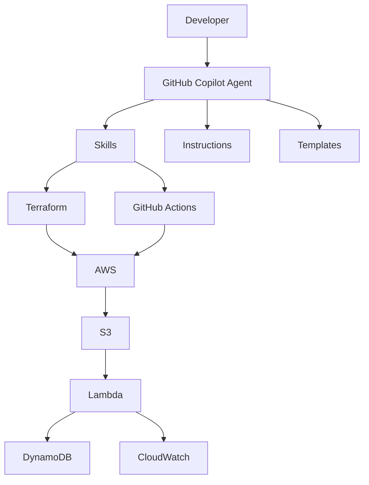
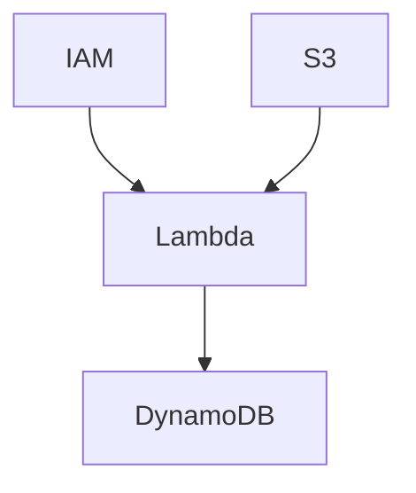
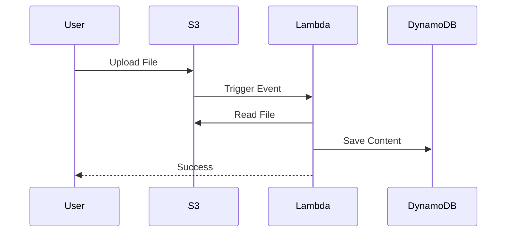
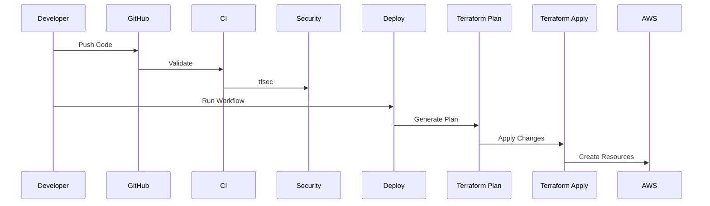
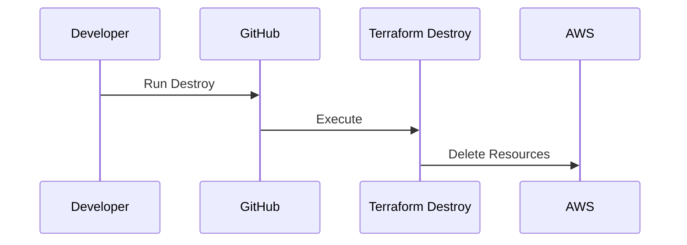
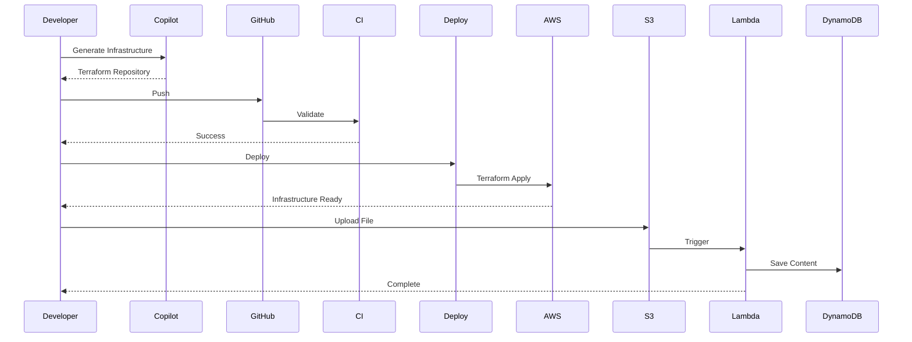

# ARCHITECTURE.md

# GitHub Copilot Infrastructure Engineering Platform

> End-to-End Architecture Guide

---

# Table of Contents

- Solution Overview
- High-Level Architecture
- Repository Architecture
- GitHub Copilot Architecture
- Agent Architecture
- Skill Architecture
- Terraform Architecture
- GitHub Actions Architecture
- AWS Architecture
- Serverless Flow
- Deployment Flow
- Destroy Flow
- Component Interaction
- Security Architecture
- Sequence Diagrams
- Future Architecture

---

# 1. Solution Overview

This project demonstrates how to build a production-ready Infrastructure Engineering Platform powered by GitHub Copilot.

The repository enables developers to generate:

- Modular Terraform
- Reusable GitHub Actions
- Production-ready AWS Infrastructure
- Enterprise documentation
- Security-first infrastructure

using custom:

- Agents
- Skills
- Instructions
- Templates
- Examples

---

# 2. High-Level Architecture



---

# 3. Repository Architecture

```text
Repository

│

├── .github

│      ├── workflows

│      └── copilot

│             ├── agents

│             ├── skills

│             ├── instructions

│             ├── hooks

│             ├── plugins

│             └── extensions

│

├── terraform

│      ├── modules

│      ├── projects

│      └── environments

│

├── src

│      └── lambda_function

│

├── docs

│

└── scripts
```

---

# 4. GitHub Copilot Architecture

```mermaid
graph LR

Developer

-->

Agent

-->

Instruction

-->

Skill

-->

Template

-->

Generated Code
```

---

# 5. Agent Architecture

```text
Infrastructure Agent

│

├── Reads Instructions

│

├── Selects Skills

│

├── Reads Templates

│

├── Reads Examples

│

└── Generates Code
```

---

# Agent Responsibilities

- Understand user request
- Select appropriate skills
- Follow repository instructions
- Generate reusable workflows
- Generate modular Terraform
- Explain generated code

---

# 6. Skill Architecture

```text
Terraform Skill

│

├── SKILL.md

├── examples

└── templates

GitHub Actions Skill

│

├── SKILL.md

├── examples

└── templates

AWS Skill

│

├── SKILL.md

├── examples

└── templates

Security Skill

│

├── SKILL.md

├── examples

└── templates
```

---

# Skill Selection Flow

```mermaid
flowchart TD

Request

-->

Agent

-->

Terraform Skill

-->

GitHub Actions Skill

-->

AWS Skill

-->

Security Skill

-->

Generated Repository
```

---

# 7. Terraform Architecture

```text
terraform

│

├── modules

│      ├── lambda

│      ├── iam

│      ├── s3

│      └── dynamodb

│

├── environments

│      └── dev

│

└── projects

       └── demo-serverless
```

---

# Module Dependency



---

# Resource Dependency

```text
IAM Role

↓

Lambda

↓

CloudWatch

S3

↓

Event Notification

↓

Lambda

↓

DynamoDB
```

---

# 8. GitHub Actions Architecture

```text
CI

↓

Validate

↓

Security Scan

Deploy

↓

Terraform Plan

↓

Terraform Apply

Destroy

↓

Terraform Destroy
```

---

# Workflow Relationship

```mermaid
graph TD

Push

-->

CI

CI

-->

Security

Manual Deploy

-->

Deploy

Deploy

-->

Terraform Plan

Terraform Plan

-->

Terraform Apply

Manual Destroy

-->

Terraform Destroy
```

---

# Reusable Workflow Design

```text
deploy.yml

│

├── terraform-plan.yml

└── terraform-apply.yml

destroy.yml

│

└── terraform-destroy.yml
```

---

# 9. AWS Infrastructure

```mermaid
graph LR

GitHub

-->

OIDC

-->

IAM Role

-->

Terraform

-->

AWS

AWS

-->

S3

AWS

-->

Lambda

AWS

-->

DynamoDB

S3

-->

Lambda

Lambda

-->

DynamoDB
```

---

# AWS Resources

- IAM Role
- Lambda
- S3 Bucket
- DynamoDB Table
- CloudWatch Logs

---

# 10. Serverless Flow



---

# Runtime Flow

```text
Upload File

↓

S3 Event

↓

Lambda Trigger

↓

Download Object

↓

Read Content

↓

Store Item

↓

CloudWatch Logs
```

---

# 11. Deployment Flow



---

# Deployment Pipeline

```text
Developer

↓

Git Push

↓

CI

↓

Validate

↓

Security Scan

↓

Manual Approval

↓

Terraform Plan

↓

Terraform Apply

↓

AWS
```

---

# 12. Destroy Flow



---

# Destroy Pipeline

```text
GitHub Actions

↓

Destroy

↓

Terraform Destroy

↓

AWS Delete

↓

Resources Removed
```

---

# 13. Component Interaction

```text
Developer

↓

GitHub Copilot

↓

Agent

↓

Skills

↓

Terraform

↓

GitHub Actions

↓

AWS
```

---

# 14. Security Architecture

```mermaid
graph TD

GitHub

-->

OIDC

-->

IAM Role

IAM Role

-->

Terraform

Terraform

-->

AWS

AWS

-->

Encrypted S3

AWS

-->

CloudWatch
```

---

# Security Principles

- No AWS Access Keys
- OIDC Authentication
- Temporary Credentials
- IAM Least Privilege
- Encrypted S3
- CloudWatch Logging
- Reusable Workflows
- Repository Instructions
- Enterprise Templates

---

# 15. Complete End-to-End Sequence



---

# 16. Future Architecture

The repository can be extended to support:

- Amazon ECS
- Amazon EKS
- API Gateway
- EventBridge
- SNS
- SQS
- Step Functions
- Bedrock
- OpenSearch
- RAG Pipelines
- LangGraph Agents
- GitHub Environments
- Multi-account Deployments
- Multi-region Deployments
- Policy as Code
- FinOps
- DevSecOps
- Platform Engineering

---

# Architecture Summary

This platform demonstrates an enterprise approach to Infrastructure as Code using:

- GitHub Copilot Custom Agents
- GitHub Copilot Skills
- Repository Instructions
- Modular Terraform
- Reusable GitHub Actions
- AWS OIDC Authentication
- Serverless Architecture
- Security Best Practices
- Production-Ready Repository Structure

This architecture is intentionally modular so additional AWS services, environments, and Copilot skills can be integrated with minimal changes.
