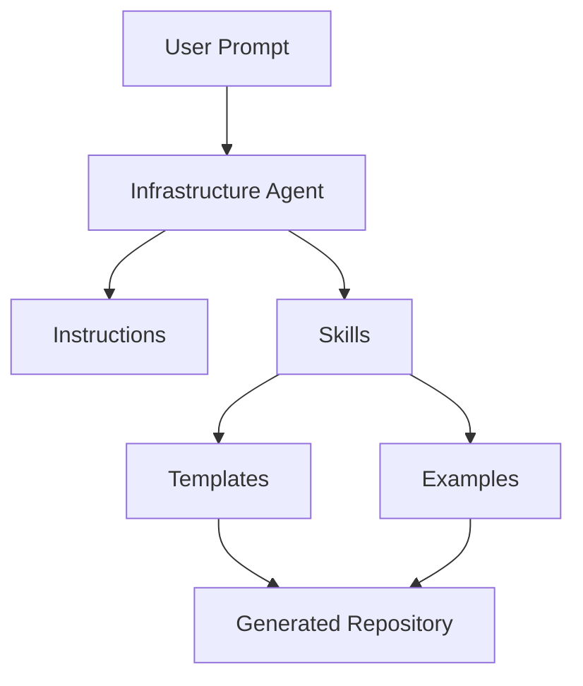

# COPILOT_SETUP.md

# GitHub Copilot Setup Guide

> Complete guide for building a production-ready GitHub Copilot repository using Custom Agents, Skills, Instructions, Hooks, Plugins, Templates, and reusable GitHub Actions.

---

# Table of Contents

1. Introduction
2. Repository Structure
3. Copilot Resource Hierarchy
4. Agent Architecture
5. Instructions
6. Skills
7. Templates
8. Examples
9. Hooks
10. Plugins
11. Extensions
12. Workflow Execution
13. End-to-End Generation Flow
14. Building New Skills
15. Best Practices
16. Common Mistakes
17. Repository Checklist

---

# 1. Introduction

GitHub Copilot can become an engineering assistant instead of only a code generator.

Instead of prompting:

> Generate Terraform

You teach Copilot **how your organization builds Terraform.**

Everything in this repository exists to make Copilot generate consistent, reusable, production-ready code.

---

# 2. Repository Structure

```
.github/

└── copilot

    ├── agents

    ├── instructions

    ├── skills

    ├── hooks

    ├── plugins

    ├── extensions

    ├── workflows

    └── docs
```

---

# 3. Complete Repository

```
.github

│

├── workflows

│

└── copilot

    │

    ├── agents

    │     └── infrastructure-agent.md

    │

    ├── instructions

    │     ├── coding.instructions.md

    │     ├── terraform.instructions.md

    │     ├── github-actions.instructions.md

    │     ├── aws.instructions.md

    │     └── security.instructions.md

    │

    ├── skills

    │     ├── terraform

    │     ├── github-actions

    │     ├── aws

    │     └── security

    │

    ├── hooks

    │

    ├── plugins

    │

    ├── extensions

    │

    └── docs
```

---

# 4. Copilot Resource Hierarchy

```
User Prompt

↓

Agent

↓

Instructions

↓

Skills

↓

Templates

↓

Examples

↓

Generated Code
```

Every level improves the generated result.

---

# 5. Agent

Agents decide

- what to build
- which skills to use
- which instructions to follow

Example

```
infrastructure-agent.md
```

Responsibilities

- Read instructions
- Select Terraform Skill
- Select AWS Skill
- Select GitHub Actions Skill
- Generate repository
- Explain architecture

---

# 6. Infrastructure Agent Flow

```
User

↓

Infrastructure Agent

↓

Read Instructions

↓

Read Skills

↓

Read Templates

↓

Generate Code
```

---

# 7. Instructions

Instructions define

- coding standards
- naming conventions
- repository standards

Example

```
coding.instructions.md

terraform.instructions.md

github-actions.instructions.md

aws.instructions.md

security.instructions.md
```

Instructions should contain

- Naming conventions
- Folder structure
- Variable naming
- Security rules
- Coding style
- Enterprise recommendations

Instructions should never contain implementation code.

---

# 8. Skill

A Skill teaches Copilot

**how to solve a specific problem.**

Example

```
Terraform Skill

GitHub Actions Skill

AWS Skill

Security Skill
```

Each Skill is independent.

---

# 9. Recommended Skill Structure

```
terraform

│

├── SKILL.md

├── examples

├── templates

└── docs
```

---

# 10. Terraform Skill

Example

```
terraform

├── SKILL.md

├── examples

│      module-example.tf

│      lambda.tf

│      s3.tf

│

├── templates

│      module-template.tf

│      provider.tf

│      backend.tf

│

└── docs

       terraform-guide.md
```

---

# 11. GitHub Actions Skill

```
github-actions

├── SKILL.md

├── examples

│      ci.yml

│      deploy.yml

│      destroy.yml

│

├── templates

│      reusable-workflow.yml

│      oidc.yml

│

└── docs
```

---

# 12. AWS Skill

```
aws

├── SKILL.md

├── examples

├── templates

└── docs
```

---

# 13. Security Skill

```
security

├── SKILL.md

├── examples

├── templates

└── docs
```

---

# 14. Why Templates Matter

Without templates

```
Prompt

↓

LLM Guess

↓

Generated Code
```

With templates

```
Prompt

↓

Skill

↓

Template

↓

Repository Standard

↓

Generated Code
```

Templates make Copilot consistent.

---

# 15. Why Examples Matter

Examples teach Copilot

- naming
- architecture
- style
- module layout

Example

```
examples/

ci.yml

terraform-plan.yml

terraform-apply.yml

destroy.yml
```

Copilot copies patterns from examples.

---

# 16. Hooks

Hooks automate tasks before or after generation.

Structure

```
hooks

│

├── README.md

└── hooks.json
```

Example

```
Generate README

↓

Run Formatter

↓

Validate Repository
```

---

# 17. Plugins

Plugins extend Copilot.

Structure

```
plugins

└── plugin-name

       plugin.json
```

Plugins can

- validate code
- call APIs
- integrate external tools

---

# 18. Extensions

Extensions enhance the Copilot experience.

Structure

```
extensions

└── extension.mjs
```

Examples

- Custom UI
- Chat commands
- Canvas extensions

---

# 19. Documentation

Every Skill should have documentation.

```
docs

│

├── architecture.md

├── best-practices.md

├── examples.md

└── troubleshooting.md
```

---

# 20. End-to-End Flow



---

# 21. Example Prompt

```
Use the Infrastructure Engineering Agent.

Create a production-ready Terraform project.

Requirements

AWS

Lambda

S3

DynamoDB

Generate reusable GitHub Actions.

Generate modular Terraform.

Generate documentation.

Follow all repository instructions.
```

---

# 22. What Happens Internally

```
Prompt

↓

Infrastructure Agent

↓

Read coding.instructions

↓

Read terraform.instructions

↓

Read GitHub Actions instructions

↓

Select Terraform Skill

↓

Select AWS Skill

↓

Select GitHub Actions Skill

↓

Read Templates

↓

Read Examples

↓

Generate Repository
```

---

# 23. Skill Development Lifecycle

```
Create SKILL.md

↓

Create Examples

↓

Create Templates

↓

Create Documentation

↓

Test

↓

Improve

↓

Publish
```

---

# 24. Adding a New Skill

Example

```
skills

└── kubernetes
```

Structure

```
kubernetes

├── SKILL.md

├── examples

├── templates

└── docs
```

Update

```
Infrastructure Agent
```

Add

```
If Kubernetes request

↓

Use Kubernetes Skill
```

---

# 25. Repository Growth

```
Current

Terraform

AWS

Security

GitHub Actions

↓

Future

Docker

Kubernetes

Helm

ArgoCD

OpenSearch

Bedrock

LangGraph

Python

Observability

FinOps
```

---

# 26. Best Practices

- Keep each Skill focused on one domain.
- Store reusable code in templates.
- Store working implementations in examples.
- Keep instructions implementation-agnostic.
- Use modular Terraform.
- Prefer reusable workflows.
- Document every Skill.
- Version Skills as they evolve.
- Keep prompts simple; let Agents orchestrate Skills.
- Review generated code before deployment.

---

# 27. Common Mistakes

Avoid

- One giant SKILL.md covering multiple domains.
- Embedding templates directly in instructions.
- Hardcoding AWS account IDs or credentials.
- Mixing examples with templates.
- Duplicating GitHub Actions YAML.
- Using one Terraform module for everything.
- Storing secrets in the repository.

---

# 28. Repository Checklist

## Agents

- [ ] Infrastructure Agent created
- [ ] Agent references all instructions
- [ ] Agent references all skills

## Instructions

- [ ] Coding standards
- [ ] Terraform standards
- [ ] AWS standards
- [ ] GitHub Actions standards
- [ ] Security standards

## Skills

- [ ] Terraform
- [ ] GitHub Actions
- [ ] AWS
- [ ] Security

## Templates

- [ ] Terraform
- [ ] GitHub Actions
- [ ] IAM
- [ ] OIDC

## Examples

- [ ] Terraform modules
- [ ] Reusable workflows
- [ ] Lambda examples

## Documentation

- [ ] README
- [ ] AWS_SETUP
- [ ] ARCHITECTURE
- [ ] GITHUB_ACTIONS_GUIDE
- [ ] TERRAFORM_GUIDE
- [ ] SERVERLESS_DEMO
- [ ] TROUBLESHOOTING

---

# 29. Final Architecture

```
Developer

↓

GitHub Copilot

↓

Infrastructure Agent

↓

Instructions

↓

Skills

↓

Templates

↓

Examples

↓

Generated Repository

↓

GitHub Actions

↓

Terraform

↓

AWS
```

---

# Next Documents

- TERRAFORM_GUIDE.md
- SERVERLESS_DEMO.md
- SECURITY_BEST_PRACTICES.md
- TROUBLESHOOTING.md

This completes the GitHub Copilot setup documentation and provides the foundation for building reusable, enterprise-grade Copilot repositories.
