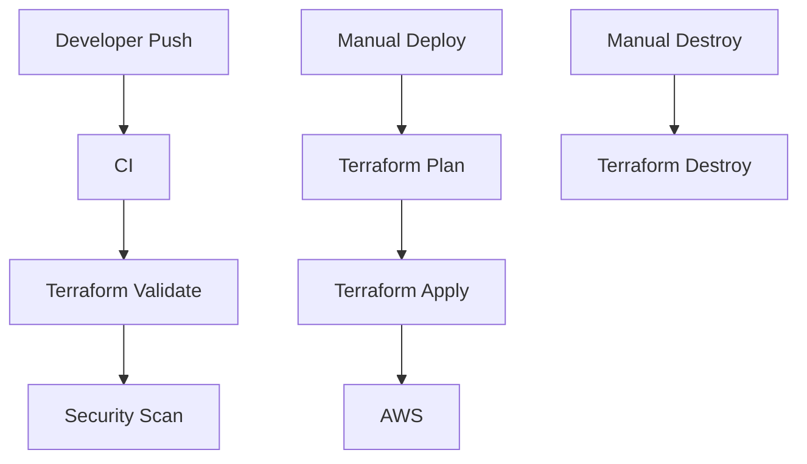
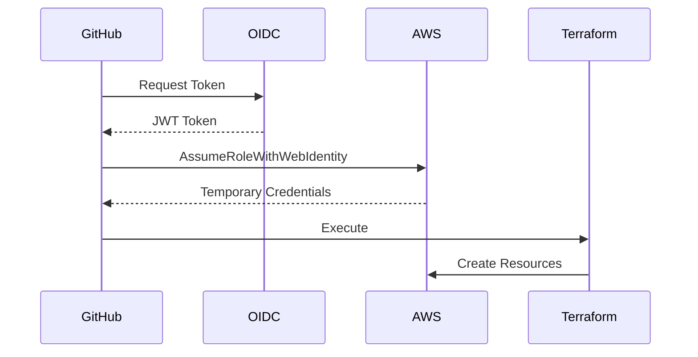

# GITHUB_ACTIONS_GUIDE.md

# GitHub Actions Guide

> Enterprise guide for designing reusable GitHub Actions workflows for the GitHub Copilot Infrastructure Engineering Platform.

---

# Table of Contents

1. Overview
2. Workflow Architecture
3. Workflow Structure
4. Workflow Execution Flow
5. CI Workflow
6. Security Scan Workflow
7. Deploy Workflow
8. Terraform Plan Workflow
9. Terraform Apply Workflow
10. Terraform Destroy Workflow
11. GitHub Repository Configuration
12. GitHub Environments
13. GitHub Variables
14. GitHub Secrets
15. Workflow Permissions
16. Reusable Workflows
17. Deployment Lifecycle
18. Local Testing
19. Troubleshooting
20. Best Practices

---

# 1. Overview

This repository uses reusable GitHub Actions workflows to deploy Terraform infrastructure.

The objectives are:

- Reusable workflows
- Modular CI/CD
- OIDC Authentication
- Infrastructure as Code
- Security-first deployment
- Enterprise workflow design

---

# 2. Workflow Architecture

```text
Developer

    │

    ▼

Git Push

    │

    ▼

CI

    │

    ├── Terraform Format

    ├── Terraform Validate

    └── Security Scan

    │

    ▼

Manual Deploy

    │

    ▼

Terraform Plan

    │

    ▼

Terraform Apply

    │

    ▼

AWS Infrastructure

    │

    ▼

Manual Destroy

    │

    ▼

Terraform Destroy
```

---

# 3. Workflow Structure

```
.github/workflows

│

├── ci.yml

├── deploy.yml

├── destroy.yml

├── security-scan.yml

├── terraform-plan.yml

├── terraform-apply.yml

└── terraform-destroy.yml
```

---

# 4. Workflow Responsibilities

| Workflow              | Purpose                     |
| --------------------- | --------------------------- |
| ci.yml                | Validate repository         |
| security-scan.yml     | tfsec security scan         |
| deploy.yml            | Deployment entry workflow   |
| terraform-plan.yml    | Generate Terraform plan     |
| terraform-apply.yml   | Apply Terraform             |
| destroy.yml           | Destroy entry workflow      |
| terraform-destroy.yml | Destroy Terraform resources |

---

# 5. Complete Execution Flow



---

# 6. CI Workflow

File

```
.github/workflows/ci.yml
```

Trigger

```yaml
on:

push:

pull_request:
```

Purpose

- Checkout Repository
- Terraform Format
- Terraform Init
- Terraform Validate
- Call Security Workflow

Execution

```
Push

↓

CI

↓

terraform fmt

↓

terraform init

↓

terraform validate

↓

security-scan.yml
```

---

# 7. Security Scan Workflow

File

```
security-scan.yml
```

Trigger

```yaml
on:

workflow_call:
```

Purpose

- tfsec
- Terraform security validation

Called By

```
ci.yml
```

Execution

```
CI

↓

Security Scan

↓

tfsec

↓

Pass / Fail
```

---

# 8. Deploy Workflow

File

```
deploy.yml
```

Trigger

```yaml
workflow_dispatch
```

Purpose

Deployment Orchestrator

It never runs Terraform directly.

Instead it calls

```
terraform-plan.yml

terraform-apply.yml
```

Execution

```
Developer

↓

Run Workflow

↓

deploy.yml

↓

terraform-plan.yml

↓

terraform-apply.yml
```

---

# 9. Terraform Plan Workflow

File

```
terraform-plan.yml
```

Trigger

```yaml
workflow_call
```

Purpose

- Configure AWS Credentials
- Terraform Init
- Terraform Plan
- Upload tfplan

Execution

```
Terraform Init

↓

Terraform Plan

↓

Upload Artifact
```

Artifact

```
tfplan
```

---

# 10. Terraform Apply Workflow

File

```
terraform-apply.yml
```

Trigger

```yaml
workflow_call
```

Purpose

- Download tfplan
- Terraform Apply

Execution

```
Download Plan

↓

Terraform Apply

↓

AWS Resources
```

---

# 11. Destroy Workflow

File

```
destroy.yml
```

Trigger

```yaml
workflow_dispatch
```

Purpose

Manual infrastructure removal

Execution

```
Developer

↓

Run Destroy

↓

terraform-destroy.yml
```

---

# 12. Terraform Destroy Workflow

File

```
terraform-destroy.yml
```

Trigger

```yaml
workflow_call
```

Execution

```
Terraform Init

↓

Terraform Destroy

↓

Delete AWS Resources
```

---

# 13. Repository Configuration

Open

```
GitHub Repository

↓

Settings

↓

Secrets and Variables

↓

Actions
```

---

# 14. GitHub Secrets

```
AWS_ROLE_TO_ASSUME
```

Example

```
arn:aws:iam::123456789012:role/GitHubActionsTerraformRole
```

---

# 15. GitHub Variables

```
AWS_REGION
```

Example

```
ap-south-1
```

```
TF_PROJECT
```

Example

```
demo-serverless
```

```
TF_VERSION
```

Example

```
1.6.6
```

---

# 16. Workflow Permissions

Every entry workflow

```
ci.yml

deploy.yml

destroy.yml
```

must include

```yaml
permissions:

contents: read

id-token: write
```

Every reusable workflow

```
terraform-plan.yml

terraform-apply.yml

terraform-destroy.yml
```

must also include

```yaml
permissions:

contents: read

id-token: write
```

Without

```
id-token: write
```

OIDC authentication fails.

---

# 17. Reusable Workflow Design

```
deploy.yml

│

├── terraform-plan.yml

└── terraform-apply.yml
```

```
destroy.yml

│

└── terraform-destroy.yml
```

Advantages

- No duplicated code
- Centralized Terraform logic
- Easy maintenance
- Enterprise pattern

---

# 18. Artifact Flow

```
Terraform Plan

↓

tfplan

↓

Upload Artifact

↓

Terraform Apply

↓

Download Artifact

↓

Apply
```

This guarantees that the exact reviewed execution plan is applied.

---

# 19. Environment Flow

```
workflow_dispatch

↓

Environment

↓

dev

↓

Terraform

↓

AWS
```

Future

```
dev

↓

qa

↓

uat

↓

prod
```

The same reusable workflows can deploy every environment.

---

# 20. OIDC Authentication Flow



---

# 21. Deployment Lifecycle

```
Developer

↓

Commit

↓

Push

↓

CI

↓

Terraform Validate

↓

Security Scan

↓

Run Deploy

↓

Terraform Plan

↓

Terraform Apply

↓

AWS

↓

Testing

↓

Run Destroy

↓

Terraform Destroy
```

---

# 22. Local Testing

Before using GitHub Actions

Run locally

```bash
cd terraform/projects/demo-serverless

terraform fmt -recursive

terraform init

terraform validate

terraform plan \
-var-file=../../environments/dev/terraform.tfvars \
-out=tfplan
```

If local validation succeeds, push to GitHub.

---

# 23. Common Workflow Commands

View workflow runs

```
GitHub

↓

Actions
```

Re-run failed workflow

```
Workflow

↓

Re-run Jobs
```

Download artifact

```
Actions

↓

Workflow

↓

Artifacts
```

View logs

```
Actions

↓

Workflow

↓

Job

↓

Step Logs
```

---

# 24. Troubleshooting

| Error                     | Cause               | Solution                              |
| ------------------------- | ------------------- | ------------------------------------- |
| Invalid workflow          | YAML syntax         | Validate YAML                         |
| id-token: none            | Missing permissions | Add `permissions: id-token: write`    |
| AccessDenied              | IAM Role            | Verify role policy                    |
| AssumeRoleWithWebIdentity | Trust policy        | Verify OIDC trust relationship        |
| Terraform Init Failed     | Backend             | Verify S3 bucket and DynamoDB table   |
| Plan Failed               | Invalid variables   | Check `terraform.tfvars`              |
| Apply Failed              | AWS permissions     | Review IAM permissions                |
| tfsec Failed              | Security issue      | Fix Terraform findings                |
| Artifact Missing          | Plan not uploaded   | Verify upload/download artifact steps |

---

# 25. Best Practices

- Separate CI and CD.
- Use reusable workflows instead of duplicating YAML.
- Authenticate to AWS using OIDC.
- Never store AWS Access Keys in GitHub.
- Always review `terraform plan` before `apply`.
- Keep deployment manual for infrastructure changes.
- Store reusable values in GitHub Variables.
- Store sensitive values in GitHub Secrets.
- Use GitHub Environments for production approvals.
- Keep Terraform modules small and reusable.
- Add security scanning before deployment.
- Use artifacts to pass the reviewed execution plan from Plan to Apply.

---

# 26. Complete Workflow Summary

```text
Developer

↓

Git Push

↓

ci.yml

↓

Terraform Format

↓

Terraform Init

↓

Terraform Validate

↓

security-scan.yml

↓

Developer Reviews Changes

↓

Run deploy.yml

↓

terraform-plan.yml

↓

tfplan Artifact

↓

terraform-apply.yml

↓

AWS Resources Created

↓

Upload File to S3

↓

Lambda Triggered

↓

Write Data to DynamoDB

↓

Testing Complete

↓

Run destroy.yml

↓

terraform-destroy.yml

↓

Infrastructure Removed
```

---

# Next Documents

Continue with:

- COPILOT_SETUP.md
- TERRAFORM_GUIDE.md
- SERVERLESS_DEMO.md
- SECURITY_BEST_PRACTICES.md
- TROUBLESHOOTING.md
