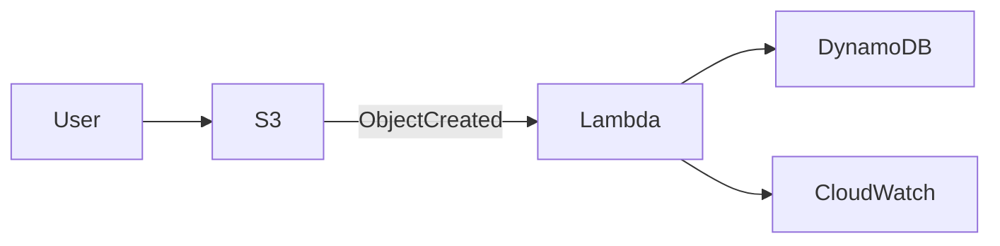
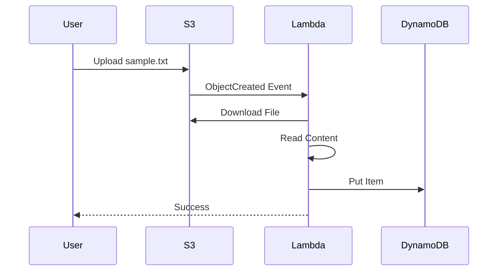

# SERVERLESS_DEMO.md

# Demo Serverless Project

> End-to-End Walkthrough (S3 → Lambda → DynamoDB)

---

# Table of Contents

1. Introduction
2. Use Case
3. Architecture
4. Repository Structure
5. AWS Resources
6. Terraform Flow
7. Deployment Flow
8. Runtime Flow
9. Lambda Logic
10. Testing
11. Verification
12. Cleanup
13. Troubleshooting
14. Future Improvements

---

# 1. Introduction

The **demo-serverless** project demonstrates a simple, production-style serverless architecture using Terraform and GitHub Actions.

This project is intentionally kept small so it can be used as a learning project for:

- GitHub Copilot Agents
- Terraform Modules
- GitHub Actions
- AWS OIDC
- Serverless Applications

---

# 2. Use Case

Whenever a user uploads a file to Amazon S3:

- S3 generates an event.
- Lambda is automatically invoked.
- Lambda downloads the uploaded file.
- Lambda reads the file contents.
- Lambda stores the file metadata and content in DynamoDB.

No API Gateway.

No Step Functions.

No SQS.

Just a clean event-driven workflow.

---

# 3. Solution Architecture



---

# 4. AWS Resources

The project creates:

| Resource        | Purpose                |
| --------------- | ---------------------- |
| S3 Bucket       | File Upload            |
| Lambda Function | Process uploaded files |
| DynamoDB Table  | Store file content     |
| IAM Role        | Lambda permissions     |
| CloudWatch Logs | Logging                |

---

# 5. Repository Structure

```
terraform

├── modules
│
│   ├── iam
│   ├── lambda
│   ├── s3
│   └── dynamodb
│
├── environments
│
│   └── dev
│
└── projects
    └── demo-serverless
```

Lambda source

```
src/

└── lambda

      index.py
```

---

# 6. Infrastructure Architecture

```text
Terraform

↓

Project

↓

IAM

↓

Lambda

↓

S3

↓

DynamoDB
```

---

# 7. Deployment Flow

```mermaid
flowchart TD

Developer

-->

GitHub

-->

CI

-->

Security Scan

-->

Deploy

-->

Terraform Plan

-->

Terraform Apply

-->

AWS
```

---

# 8. Runtime Flow

```text
Upload File

↓

S3 Bucket

↓

ObjectCreated Event

↓

Lambda Trigger

↓

Download Object

↓

Read File

↓

Insert Item

↓

DynamoDB

↓

CloudWatch Logs
```

---

# 9. Sequence Diagram



---

# 10. Terraform Modules

The project contains four reusable modules.

### IAM

Creates

- Lambda Role
- IAM Policy
- Policy Attachment

---

### S3

Creates

- Bucket
- Versioning
- Encryption
- Event Notification

---

### Lambda

Creates

- Function
- Environment Variables
- CloudWatch Log Group

---

### DynamoDB

Creates

- Table
- Hash Key
- PAY_PER_REQUEST Billing

---

# 11. Lambda Logic

Pseudo code

```
Receive Event

↓

Get Bucket Name

↓

Get Object Key

↓

Download File

↓

Read Content

↓

Insert Into DynamoDB

↓

Return Success
```

---

# 12. Example Event

```json
{
  "Records": [
    {
      "s3": {
        "bucket": {
          "name": "demo-serverless-dev-bucket"
        },
        "object": {
          "key": "sample.txt"
        }
      }
    }
  ]
}
```

---

# 13. DynamoDB Item

Example

```json
{
  "id": "sample.txt",

  "bucket": "demo-serverless-dev",

  "content": "Hello World",

  "uploadedAt": "2026-07-14T10:00:00Z"
}
```

---

# 14. Environment Variables

Lambda receives

```
TABLE_NAME

BUCKET_NAME
```

Terraform injects these automatically.

---

# 15. Deploying the Project

Push code

```bash
git add .

git commit -m "Serverless Demo"

git push origin main
```

CI executes

```
Terraform Validate

↓

Security Scan
```

Deploy

```
GitHub

↓

Actions

↓

Deploy

↓

Run Workflow
```

---

# 16. Upload a Test File

Using AWS CLI

```bash
aws s3 cp sample.txt s3://demo-serverless-dev-bucket
```

or

AWS Console

```
S3

↓

Bucket

↓

Upload

↓

sample.txt
```

---

# 17. What Happens Next

```
S3 Upload

↓

Event Notification

↓

Lambda Trigger

↓

Read File

↓

PutItem

↓

DynamoDB

↓

CloudWatch Logs
```

---

# 18. Verify Lambda

AWS Console

```
Lambda

↓

Functions

↓

demo-serverless-dev-handler

↓

Monitor

↓

View Logs
```

Expected

```
Processing sample.txt

Upload Successful
```

---

# 19. Verify DynamoDB

AWS Console

```
DynamoDB

↓

Tables

↓

demo-serverless-dev-table

↓

Explore Items
```

Expected

```
sample.txt

Hello World

Timestamp
```

---

# 20. Verify CloudWatch

```
CloudWatch

↓

Log Groups

↓

Lambda

↓

Latest Stream
```

You should see

```
Bucket Name

Object Key

Processing Started

PutItem Success
```

---

# 21. Destroy Infrastructure

GitHub

```
Actions

↓

Destroy Infrastructure

↓

Run Workflow
```

Execution

```
destroy.yml

↓

terraform-destroy.yml

↓

Terraform Destroy

↓

AWS Resources Deleted
```

---

# 22. Manual Destroy

```bash
cd terraform/projects/demo-serverless

terraform destroy \
-var-file=../../environments/dev/terraform.tfvars
```

---

# 23. Troubleshooting

| Problem                 | Solution                                  |
| ----------------------- | ----------------------------------------- |
| Lambda not invoked      | Verify S3 Event Notification              |
| AccessDenied            | Verify Lambda IAM Role                    |
| DynamoDB PutItem failed | Check IAM Policy                          |
| File not found          | Verify bucket name                        |
| Empty content           | Check Lambda code                         |
| UTF-8 decode error      | Upload text file or update parsing logic  |
| No CloudWatch logs      | Verify execution role and log permissions |

---

# 24. Cost Estimate (AWS Free Tier)

| Service    | Usage              |
| ---------- | ------------------ |
| Lambda     | Free Tier Eligible |
| S3         | Free Tier Eligible |
| DynamoDB   | Free Tier Eligible |
| CloudWatch | Mostly Free Tier   |
| IAM        | Free               |

Estimated monthly cost while learning:

```
~$0
```

(if usage remains within AWS Free Tier limits)

---

# 25. Best Practices

- Use modular Terraform.
- Keep Lambda functions focused on one responsibility.
- Use environment variables instead of hardcoded values.
- Enable S3 encryption and versioning.
- Use PAY_PER_REQUEST for DynamoDB during development.
- Use GitHub OIDC instead of AWS access keys.
- Keep CI and deployment workflows separate.
- Destroy infrastructure when testing is complete to avoid unnecessary costs.

---

# 26. Future Enhancements

This demo can be extended with:

- API Gateway
- EventBridge
- SQS
- SNS
- Step Functions
- OpenSearch
- Amazon Bedrock
- RAG Pipeline
- LangGraph Agents
- Virus Scanning
- Image Processing
- PDF Parsing
- Textract
- Document AI

---

# 27. End-to-End Flow Summary

```text
Developer

↓

Terraform Apply

↓

AWS Infrastructure

↓

Upload sample.txt

↓

Amazon S3

↓

ObjectCreated Event

↓

Lambda Function

↓

Download File

↓

Read Content

↓

Write to DynamoDB

↓

CloudWatch Logs

↓

Verification

↓

Destroy Infrastructure
```

---

# Demo Success Criteria

The project is considered successful when:

- ✅ Terraform creates all AWS resources.
- ✅ GitHub Actions deploys without credentials using OIDC.
- ✅ Uploading a file to S3 triggers Lambda.
- ✅ Lambda reads the file content successfully.
- ✅ DynamoDB stores the uploaded file information.
- ✅ CloudWatch logs show successful processing.
- ✅ Terraform destroy removes all infrastructure cleanly.

This demo serves as a solid foundation for learning GitHub Copilot Agents, modular Terraform, reusable GitHub Actions, and AWS serverless development.
