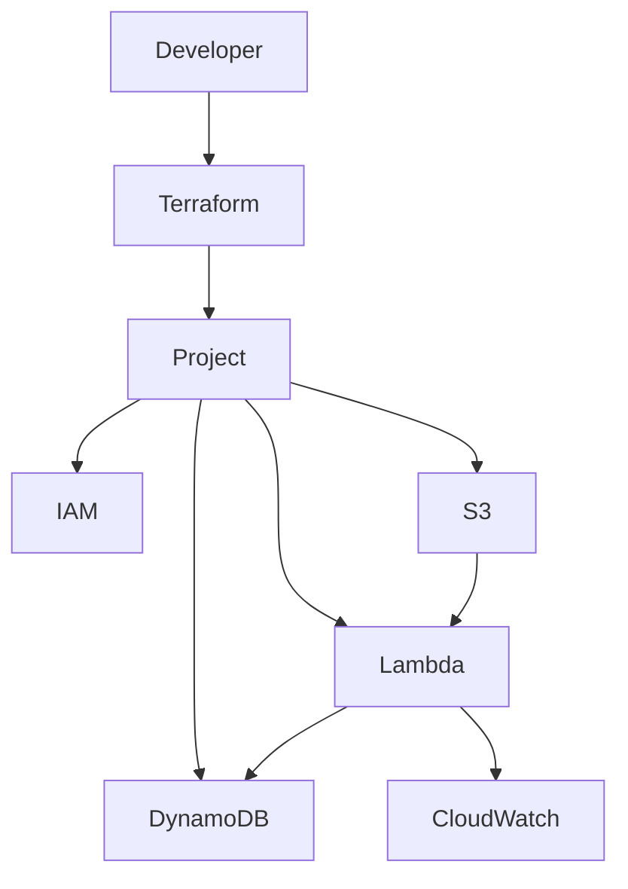

# TERRAFORM_GUIDE.md

# Terraform Guide

> Enterprise Terraform Development Guide for the GitHub Copilot Infrastructure Engineering Platform

---

# Table of Contents

1. Introduction
2. Objectives
3. Repository Structure
4. Terraform Architecture
5. Project Layout
6. Module Design
7. Environment Design
8. Backend Configuration
9. Provider Configuration
10. Variables
11. Outputs
12. State Management
13. Deployment Flow
14. Module Development Guide
15. Adding New AWS Services
16. Local Development
17. GitHub Actions Integration
18. Best Practices
19. Common Mistakes
20. Future Enhancements

---

# 1. Introduction

This repository follows a **production-ready modular Terraform architecture**.

Goals:

- Modular infrastructure
- Reusable modules
- Environment isolation
- GitHub Actions deployment
- OIDC authentication
- Easy maintenance
- Enterprise repository layout

---

# 2. Repository Structure

```
terraform

├── modules
│
│   ├── lambda
│   ├── s3
│   ├── dynamodb
│   ├── iam
│   ├── api-gateway
│   ├── sns
│   ├── sqs
│   ├── eventbridge
│   └── cloudwatch
│
├── environments
│
│   ├── dev
│   ├── qa
│   ├── uat
│   └── prod
│
└── projects
    └── demo-serverless
```

---

# 3. Module Architecture

```
modules

│

├── lambda

├── s3

├── dynamodb

└── iam
```

Each module owns one AWS service.

Modules never depend directly on one another.

Projects wire modules together.

---

# 4. Project Architecture

```
projects

└── demo-serverless

       backend.tf

       provider.tf

       locals.tf

       variables.tf

       outputs.tf

       versions.tf

       main.tf
```

Project folders should contain only orchestration logic.

Business resources belong inside modules.

---

# 5. Environment Architecture

```
environments

├── dev

│     terraform.tfvars

├── qa

│     terraform.tfvars

├── uat

│     terraform.tfvars

└── prod

      terraform.tfvars
```

Never duplicate Terraform code for environments.

Only variables should change.

---

# 6. Main.tf Responsibility

The project `main.tf` should:

- Call modules
- Pass variables
- Connect outputs
- Define dependencies

Example flow:

```
S3

↓

Lambda

↓

DynamoDB
```

---

# 7. Module Dependency

```
IAM

↓

Lambda

↓

CloudWatch

S3

↓

Lambda Trigger

↓

Lambda

↓

DynamoDB
```

---

# 8. Serverless Flow

```
User Uploads File

↓

S3 Bucket

↓

Event Notification

↓

Lambda Function

↓

Read File

↓

Store Content

↓

DynamoDB
```

---

# 9. Current Project Architecture

```
Developer

↓

Terraform

↓

IAM

↓

Lambda

↓

S3

↓

DynamoDB

↓

CloudWatch
```

---

# 10. Backend Configuration

```
terraform {
  backend "s3" {

    bucket = "demo-serverless-tfstate"

    key = "demo-serverless/dev/terraform.tfstate"

    region = "ap-south-1"

    dynamodb_table = "terraform-lock"

    encrypt = true

  }
}
```

Purpose

- Shared state
- Versioning
- State locking
- Team collaboration

---

# 11. Provider Configuration

```
provider "aws" {

  region = var.aws_region

}
```

Never hardcode regions.

---

# 12. Variables

Example

```
project_name

environment

aws_region

bucket_name

table_name

lambda_filename
```

Use descriptive names.

---

# 13. Outputs

Every reusable module should expose outputs.

Example

```
bucket_name

bucket_arn

table_name

table_arn

lambda_arn

lambda_name

role_arn
```

---

# 14. Module Design

Each module should contain

```
lambda

├── main.tf

├── variables.tf

├── outputs.tf

├── versions.tf

└── README.md
```

Every module should be deployable independently.

---

# 15. S3 Module

Responsibilities

- Bucket creation
- Encryption
- Versioning
- Event Notification
- Public Access Block

Should never create Lambda.

---

# 16. Lambda Module

Responsibilities

- Lambda Function
- Environment Variables
- IAM Attachment
- CloudWatch Logs

Should never create DynamoDB.

---

# 17. DynamoDB Module

Responsibilities

- Table
- Billing Mode
- Hash Key
- Tags

No application logic.

---

# 18. IAM Module

Responsibilities

- IAM Role
- IAM Policy
- Assume Role Policy
- Attach Policies

---

# 19. Module Communication

```
S3 Module

↓

bucket ARN

↓

Lambda Module

↓

Environment Variables

↓

DynamoDB Module
```

Modules communicate through outputs.

---

# 20. Example Deployment Flow

```
terraform init

↓

terraform validate

↓

terraform plan

↓

terraform apply

↓

Infrastructure Ready
```

---

# 21. Local Development

Initialize

```bash
terraform init
```

Format

```bash
terraform fmt -recursive
```

Validate

```bash
terraform validate
```

Plan

```bash
terraform plan \
-var-file=../../environments/dev/terraform.tfvars
```

Apply

```bash
terraform apply
```

Destroy

```bash
terraform destroy
```

---

# 22. GitHub Actions Integration

```
Git Push

↓

CI

↓

Terraform Validate

↓

Security Scan

↓

Deploy

↓

Terraform Plan

↓

Terraform Apply
```

Terraform execution is performed entirely by reusable workflows.

---

# 23. Naming Convention

Project

```
demo-serverless
```

Resources

```
demo-serverless-dev-s3

demo-serverless-dev-lambda

demo-serverless-dev-table
```

Tags

```
Project

Environment

Owner

ManagedBy=Terraform
```

---

# 24. State Management

Never commit

```
terraform.tfstate

terraform.tfstate.backup
```

Store state in S3.

Lock using DynamoDB.

---

# 25. Adding a New AWS Service

Example

```
modules

└── sns
```

Create

```
main.tf

variables.tf

outputs.tf

README.md
```

Then update

```
projects/demo-serverless/main.tf
```

Never edit existing modules unnecessarily.

---

# 26. Production Deployment

Recommended environments

```
dev

↓

qa

↓

uat

↓

prod
```

Each environment should have

- Separate backend state
- Separate tfvars
- Separate approvals
- Separate GitHub Environment

---

# 27. Best Practices

- One AWS service per module.
- Keep modules reusable.
- Use outputs instead of hardcoded values.
- Keep projects thin.
- Store state remotely.
- Use state locking.
- Use GitHub OIDC.
- Never store credentials.
- Keep modules small.
- Tag all resources.
- Validate before apply.
- Review plans before deployment.

---

# 28. Common Mistakes

Avoid

- One huge main.tf
- Hardcoded regions
- Hardcoded names
- Duplicate modules
- Local state in production
- Mixing environments
- Circular module dependencies
- Resource duplication
- Ignoring outputs
- Storing secrets in code

---

# 29. Future Expansion

The same architecture can support

```
API Gateway

↓

Lambda

↓

SQS

↓

SNS

↓

EventBridge

↓

Step Functions

↓

OpenSearch

↓

Bedrock

↓

EKS

↓

ECS

↓

RDS

↓

Aurora
```

Simply add new modules and connect them from the project layer.

---

# 30. End-to-End Architecture



---

# 31. Deployment Lifecycle

```
Developer

↓

Terraform Modules

↓

Project

↓

GitHub Actions

↓

Terraform Plan

↓

Terraform Apply

↓

AWS

↓

Testing

↓

Destroy
```

---

# 32. Terraform Checklist

## Repository

- [ ] Modular architecture
- [ ] Environment folders
- [ ] Remote backend
- [ ] Version pinning

## Modules

- [ ] README.md
- [ ] Variables
- [ ] Outputs
- [ ] Tags

## Deployment

- [ ] Validate
- [ ] Plan
- [ ] Apply
- [ ] Test
- [ ] Destroy

## Security

- [ ] OIDC
- [ ] IAM Roles
- [ ] Encrypted backend
- [ ] Least privilege

---

# Summary

This Terraform architecture separates:

- Infrastructure modules
- Environment configuration
- Project orchestration
- Deployment automation

The result is a reusable, scalable, production-ready Infrastructure as Code repository that integrates cleanly with GitHub Copilot Agents, Skills, reusable GitHub Actions workflows, and AWS best practices.
